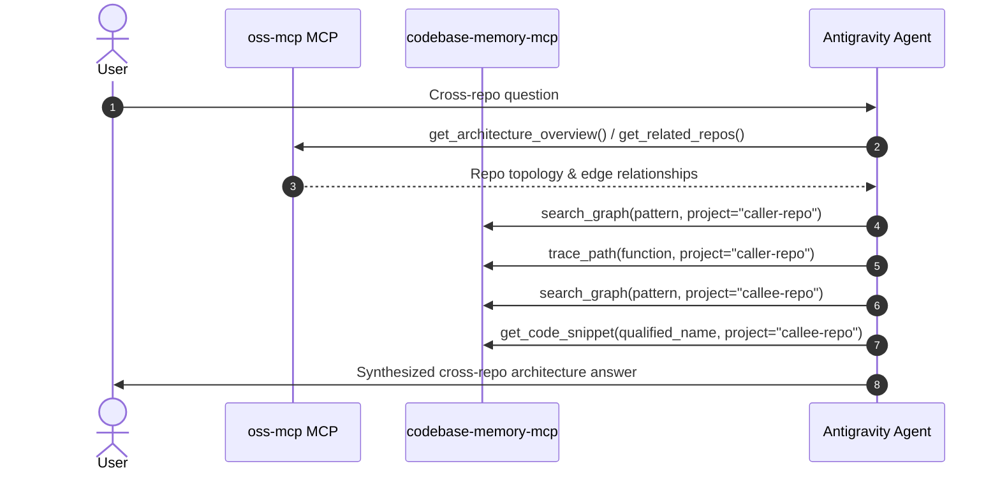

# Multi-Repo Architecture Navigator & Query Router

This skill defines the query routing and synthesis strategy for questions spanning **multiple repositories** and **cross-service interactions**.

---

## When to Activate

Activate this skill when:
- Answering questions that mention multiple repos (e.g. *"How does the frontend call the backend?"*).
- Tracing end-to-end flows across service boundaries (e.g., UI $\rightarrow$ API Gateway $\rightarrow$ Service $\rightarrow$ DB).
- Investigating cross-repo data contracts, shared auth tokens (JWT/cookies), or event payloads.

---

## Query Routing Workflow



---

## Step-by-Step Procedure

### 1. Topology Discovery
Identify which repositories participate in the flow:
- Call `get_architecture_overview(project="...")` for full project topology.
- Call `get_repo_details(repo_name="...")` to inspect a single repo's ports and connections.
- Call `get_related_repos(repo_name="...", direction="all")` to find direct callers/dependencies.

### 2. Scoped Graph Memory Queries
For each participating repository, query `codebase-memory-mcp` scoped by `project`:

```python
# A. Caller Repo (e.g. Frontend / Client)
search_graph(name_pattern=".*api.*|.*client.*", project="<caller-repo>")
trace_path(function_name="<caller_function>", direction="outbound", project="<caller-repo>")

# B. Callee Repo (e.g. Backend / API)
search_graph(name_pattern=".*controller.*|.*route.*", project="<callee-repo>")
trace_path(function_name="<controller_method>", direction="inbound", project="<callee-repo>")
get_code_snippet(qualified_name="<handler_path>", project="<callee-repo>")
```

### 3. Intent-Driven Cross-Repo Synthesis
Adapt the output strictly according to user intent:

- **Targeted Code / Implementation Inquiry**:
  - Provide direct file links, exact code snippets, parameter breakdown, and business logic.
  - Omit sequence diagrams and client layers if the user only asked about a specific service handler/model.

- **Full End-to-End Flow / Lifecycle Inquiry**:
  - Show the hop sequence: Client Request $\rightarrow$ Protocol/Headers $\rightarrow$ Middleware $\rightarrow$ Handler $\rightarrow$ Database/Events.
  - Include a concise Mermaid sequence diagram.

- **Topology & Dependency Inquiry**:
  - Present a service matrix / table with ports, tech stacks, and relationship edges (`api_call`, `event_stream`, `shared_resource`, `depends_on`).

- **General & Task Inquiries (Debugging, Refactoring, Feature Building, Q&A)**:
  - Answer directly with concise explanation and targeted code references.
  - Provide actionable multi-service diffs or concrete recommendations without template boilerplate.
