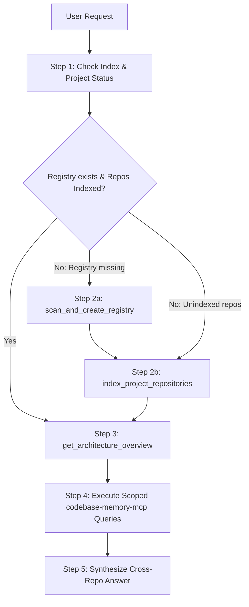

# Multi-Repo Autonomous Routing & Graph Navigation Skill

This skill provides an end-to-end autonomous workflow for multi-repo ecosystems:
1. **Verifies indexing status**
2. **Auto-scans & auto-indexes missing repos**
3. **Maps architectural relationships**
4. **Queries codebase knowledge graphs across repo boundaries**

---

## When to Activate

Activate this skill whenever the user:
- Asks an architecture question involving more than one service or repository (e.g., *"How does frontend call backend?"*, *"Trace checkout from UI to database"*).
- Mentions cross-repo workflows, API contracts, auth tokens, shared events, or database schemas.
- Asks about or works in a new/unregistered multi-repo workspace.
- Explicitly asks to scan, index, or query multi-repo codebases.

---

## Complete 5-Step Execution Workflow



---

### Step 1: Check Index & Project Status

First, inspect the available projects and indexed graphs:

1. Call `list_projects()` from the `oss-mcp` MCP server.
2. Check the response:
   - `registered_projects`: List of known multi-repo projects.
   - `indexed_codebase_memory_graphs`: List of graphs already built in `codebase-memory-mcp`.

---

### Step 2: Auto-Scan & Auto-Index (If Missing or Incomplete)

If the workspace/project is not yet registered or its repositories are not present in `indexed_codebase_memory_graphs`:

1. **If no `registry.yaml` exists for the target workspace**:
   ```python
   scan_and_create_registry(
       workspace_path="<target_directory>",
       output_file="<target_directory>/registry.yaml"
   )
   ```
   *This automatically detects all sub-repos, tech stacks (Express, React, FastAPI, Spring Boot, Go, etc.), entry points, ports, and infers API/dependency edges.*

2. **If repositories are not indexed in `codebase-memory-mcp`**:
   ```python
   index_project_repositories(
       project="<target_directory>/registry.yaml",  # or project_id
       mode="moderate"  # use 'full' if semantic similarity is needed
   )
   ```
   *This triggers batch indexing for all repos with their designated project tags.*

---

### Step 3: Discover Architecture & Relationships

Once indexed, map the cross-repo topology relevant to the user's question:

1. Call `get_architecture_overview(project="<project_id_or_path>")`.
2. Inspect `relationships[]`:
   - `api_call`: Source calls target REST/GraphQL endpoint.
   - `depends_on`: Source shares data structures, auth cookies, or contracts with target.
   - `shared_resource`: Shared database, Redis instance, or message queue.
3. If drilling down into a specific repo, call `get_repo_details(repo_name="<name>")` or `get_related_repos(repo_name="<name>", direction="all")`.

---

### Step 4: Execute Scoped `codebase-memory-mcp` Queries

Scope subsequent graph memory queries to the specific repos identified in Step 3:

```python
# 1. Search symbols / handlers in Caller Repo
search_graph(name_pattern=".*auth.*|.*api.*", project="<caller-repo>")

# 2. Trace outbound calls from Caller
trace_path(function_name="<caller_function>", direction="outbound", project="<caller-repo>")

# 3. Search endpoint / controller in Callee Repo
search_graph(name_pattern=".*controller.*|.*handler.*|.*route.*", project="<callee-repo>")

# 4. Trace inbound/outbound paths in Callee
trace_path(function_name="<callee_handler>", direction="inbound", project="<callee-repo>")

# 5. Inspect exact implementations
get_code_snippet(qualified_name="<symbol_path>", project="<target-repo>")
```

---

### Step 5: Synthesize Findings (Intent-Driven & Flexible)

Adapt the response format directly to what the user asked. **Do not force a rigid boilerplate if not requested:**

1. **If user asks for Code Implementation / Deep-Dive** (e.g. *"Where is the JWT validation implemented?"*, *"How does payment service verify webhook signature?"*):
   - Provide exact file links, function signatures, and targeted code snippets.
   - Explain the internal logic, validation rules, error handling, and parameter flow.
   - *Skip client UI layer or sequence diagrams unless specifically asked.*

2. **If user asks for Cross-Service Flow / Lifecycle Trace** (e.g. *"Trace checkout flow from UI to payment to DB"*, *"How does service A call service B?"*):
   - Detail the end-to-end hop: Client Trigger $\rightarrow$ API Gateway / Route $\rightarrow$ Auth/Middleware $\rightarrow$ Service Handler $\rightarrow$ Event / Database Mutation.
   - Include a concise Mermaid sequence diagram or flowchart.

3. **If user asks for Topology / Dependency Mapping** (e.g. *"Which services depend on auth-service?"*, *"Show all services sharing Redis"*):
   - Present a clean summary table showing Service Name, Tech Stack, Port, and Connection Type (`api_call`, `event_stream`, `shared_resource`, `depends_on`).

4. **If user asks for Contract / Schema Comparison** (e.g. *"Compare request payload between FE and BE"*, *"Check if DTOs are in sync"*):
   - Display TypeScript types, Pydantic models, or JSON schemas side-by-side highlighting matches or discrepancies.

5. **For All Other Queries (Debugging, Refactoring, Feature Addition, Audit, General Questions)**:
   - **Direct Answer First**: Address the core question immediately without boilerplate or unnecessary intro.
   - **Targeted Evidence**: Link exact source files (`[filename](file:///path)`) and include only the code snippets relevant to the problem.
   - **Actionable Steps / Code Diffs**: If fixing a bug or adding a feature across multiple services, provide clear, step-by-step implementation diffs for each affected service.
   - **No Fluff**: Do not generate sequence diagrams, tables, or architecture maps unless they are genuinely required to answer the prompt.

---

## Multi-Repo Patterns Supported

`oss-mcp` handles any multi-repository topology (not limited to 2-repo Frontend/Backend):
- **Microservices Mesh**: Gateway $\rightarrow$ Auth $\rightarrow$ Order $\rightarrow$ Payment $\rightarrow$ Notification $\rightarrow$ DB
- **Event-Driven / Pub-Sub**: Producer Service $\rightarrow$ Kafka / RabbitMQ / Redis $\rightarrow$ Consumer Workers
- **Backend-to-Backend / gRPC**: Internal microservices communication without frontend UI
- **Monorepo / Shared Packages**: Core SDKs, utility libraries, shared contracts used across services
- **Shared Infrastructure**: Multi-service access to common PostgreSQL, MongoDB, or Redis instances
